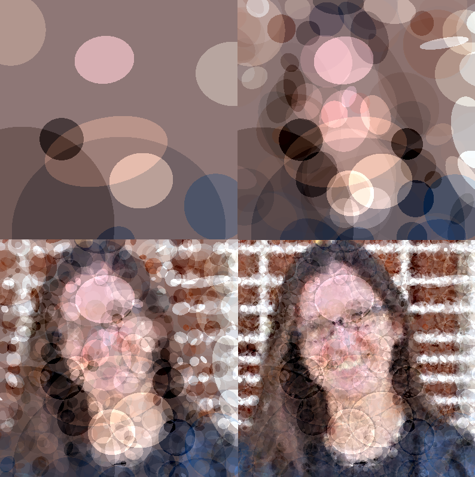

# Ellipsabelle

This is a collection of Python scripts which attempts to reconstruct a target
image by randomly coloring in a sequence of ellipses.

I'm using it to power the Twitter account
[@ellipsabelle](https://twitter.com/ellipsabelle).



## Requirements

I've made my version work with a `pip freeze` that looks like:

```
requests==2.18.4
requests-oauthlib==0.8.0
Pillow==5.0.0
```

I think you can get there with the commands:

```
pip install Pillow
pip install requests
pip install requests-oauthlib
```


## Repo Contents

### `ellipsabelle.py`

This is the library, with three class definitions:

* `Point`: An (*x*, *y*) point in the Cartesian plane.  When translating
  between image pixels and points, the pixel row maps to the *x*-coordinate,
  and column to the *y*-coordinate.  It's maybe not the most intuitive choice,
  but it's used consistently throughout the library so everything seems to work
  out okay.

* `Ellipse`: An ellipse in the Cartesian plane defined by two foci `Point`s and
  a positive distance limit value.  All points whose sum of "distance to focus
  one" plus "distance to focus two" is less than or equal to the distance limit
  are considered inside the ellipse -- and this set of pixels can be assembled
  by breadth-first search by calling `SetActive` and specifying a maximum height
  (*x* coordinate) and width (*y* coordinate).

  Optionally, an ellipse's color may be prespecified at construction time with a (red, green, blue) 3-tuple of integers between 0 and 255.

  But mostly what we'll want to use is the `SetRGB` method, which takes two
  dictionary-like objects which map `[row, column]` pairs to an RGB triple --
  one representing the target/original image, and one representing the current
  approximation.  This ellipse's RGB values will be set to values that, if added
  to the current approximation, would do the best job (averaged across all
  pixel-points in the ellipse) of making the approximation match the original.
  Note that these RGB values could be negative, "undoing" an earlier ellipse's
  contribution.

* `Ellipsabelle`: This is defined by passing it the name of an image file.
  It then holds on to an approximation of that original image, initialized to
  just be the flat, constant RGB value equal to the mean RGB of the original.
  Repeated calls to `Iterate` will generate a random set of candidate ellipses
  (who all have distance limits inside the given bounds), and order them by
  their overall ability to better color the approximation to match the original.
  These ellipses are then added to the approximation in order of how much
  they improve things -- unless they overlap with a better ellipse that's
  already been added on this call to `Iterate`, in which case it's ignored.

  You can save an `Ellipsabelle` as a text file, which just writes all of the
  ellipses in its current approximation out to a text file.

  Optionally, an `Ellipsabelle` can be initialized with some pre-fabricated
  ellipses, though those should probably already come with their RGB pre-set to
  be useful.

### `ellipsabelle_num_iter.py`

This will bulk-process a bunch of PNGs into `Ellipsabelle` objects and persists
their ellipse sequences as text files.

Invoke with:

```
python ellipsabelle_num_iter.py [png_directory] [num_ellipses] [ellipse_dir]
```

Set the integer `num_ellipses` to indicate how many ellipses you'd like to have
in the generated approximations.  All your original images should exist as
PNG files in the directory you specify in the first argument, and the directory
`ellipse_dir` should exist and be ready to have text files written to it.

### `ellipsabelle_animate.py`

This will take a directory fill of Ellipsabelle text files, like the directory
generated by `ellipsabelle_num_iter`, and produce an animated GIF from each
file.  The number of ellipses added per frame of the GIF increases
quadratically.  Invoke with:

```
python ellipsabelle_animate.py [ellipse_dir] [gif_dir]
```

### `ellipsabelle_post.py`

This will try and post a GIF to Twitter.  It is extremely similar to Twitter's
own
["large video upload" demo script.](https://github.com/twitterdev/large-video-upload-python)
Invoke with:

```
python ellipsabelle_post.py [config_file]
```

That config file should look as follows (everything outside of brackets should
appear verbatim):

```
CONSUMER_KEY = [your Twitter posting-app's consumer key]
CONSUMER_SECRET = [your Twitter posting-app's consumer key]
ACCESS_KEY = [the Twitter account's access token]
ACCESS_SECRET = [the Twitter account's access token secret]
SRC_FOLDER = [directory of GIFs to post]
DST_FOLDER = [directory in which to house GIFs after posting]
```

It picks a GIF to upload by scanning for one in `SRC_FOLDER`.
After it's finished uploading, it will move the GIF file from `SRC_FOLDER`
to `DST_FOLDER`.

You'll probably want to run the resulting GIFs through a pass of ImageMagick's
[GIF optimizer](http://www.imagemagick.org/Usage/anim_opt/) before trying to
post them -- I think Twitter has a 15MB file size limit, and the GIFs I've been creating are much, much bigger than that.
That tends to look like:

```
convert ellispabelle.gif -layers OptimizePlus optimized_ellipsabelle.gif
```

## Further reading

If you like this stuff, you should check out the work of
[Michael Fogel](https://twitter.com/FogleBird): he has a project called
[Primitive](https://primitive.lol/), and associated demo Twitter account
[@PrimitivePic](https://twitter.com/PrimitivePic).  It's much more efficient
than what I have here.

When I had this idea (err... my version of this idea...) in 2016, I was building
out [WAVProject](https://github.com/bgawalt/wav_project) -- this kind of
procedure is like a two-dimensional, visual version of WAVProject's audio
rendering.
